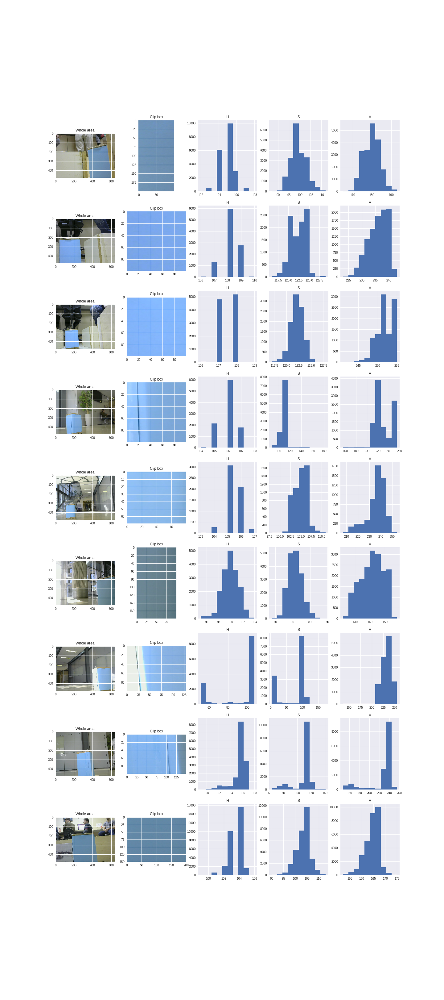
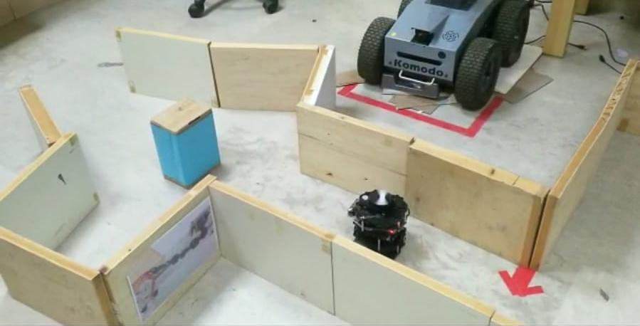
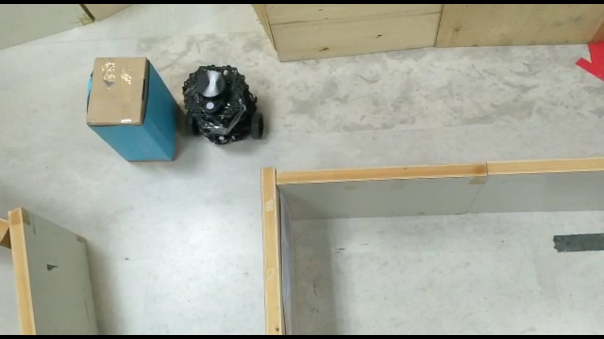

# Robotics final project
## Abstract
This is an implementation of maze navigation for Turtlebot 3. The robot should
* Map the maze
* Navigate to maze exit until locating a blue box
* Move the box out of the way
* Continue the navigation to maze exit
This uses a finite state machine and utilizes the ros navigation package.

# Running the code
* First make sure to `cd` into the catkin_workspace directory
* Before running the code, a mapping of the maze needs to be run, we used the gmapping to do so. Use the command
  ```bash
  roslaunch turtlebot3_navigation turtlebot3_navigation.launch map_file:=$HOME/map.yaml
  ```
  And save the map via
  ```bash
  rosrun map_server map_saver -f map
  ```
* Make sure the navigation node is running
  ```bash
  roslaunch turtlebot3_navigation turtlebot3_navigation.launch map_file:=$HOME/map.yaml
  ```
* Run the maze navigation program using
 ```bash
 rosrun simple_navigation_goals move_base.py
 ```
 
 # Algorithm
 ## Box Identification
 The box identifaction was used via the camera topic `usb_cam/image_raw` and the opencv_bridge pacakge.
 The identification was done via HSV parameters that where determing via exmaning verious pictures of the box
 and exploring the histogram:
 
 
 ## Point Cloud
 From the laser scan topic we generated a point cloud map using `point_cloud` package. It was
 Used as a safer alternative to examening the laser topic directly as it eliminates untracked points.
 For each point we can calculate its distance to the robot using `sqrt(x^2 + y^2)` and its angle to the robot using
 `np.arctan2(y,x)`
 
 ## State machine
 The flow of the program uses a finite state machine such that at each run of the laser callback,
 The current state decides what action to perform and what state to go to next (could be the same sate).
 
 Here is a diagram of the states in the program:
 
Some of the main states:
* **Center_box** - If box is recognized but not in center, rotate to right direction.
* **Move towards box** - If the box is  recognized and at center move towards it until the box is close. 
                         enough (determined via laser scan). If the box gets out of center, return to previous state.
                         
  
* **Move to edge** - After reaching the box move until the box is far enough to go to push state.

